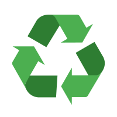

    

# Trash Cache
## Our Mission
TrashCache's mission is to empower users to make informed decisions about recycling by accurately identifying recyclable items and suggesting appropriate recycling methods, ultimately contributing to sustainable waste management and a cleaner environment3. While materials can be recycled, not everyone knows how or if a specific item is recyclable, leading to confusion and often incorrect disposal.

In today's world, recycling is more important than ever, considering its positive impacts on reducing waste and preserving our natural resources. However, distinguishing recyclable items and understanding the appropriate recycling techniques can be challenging for many individuals. Various sources such as websites, articles, and guides attempt to educate on recycling practices, but they may not always provide real-time or convenient solutions.

## Problem
Waste management and recycling are crucial for the environment, yet many struggle to determine whether an item can be recycled and how to do it properly. This lack of knowledge often leads to recyclable materials ending up in landfills.

## Our Solution
TrashCache is an Android application developed using Android Studio and integrated with a powerful API. The app utilizes advanced machine learning models to analyze images of items, providing users with clear insights into whether an item is recyclable and suggesting appropriate recycling methods. We strive to simplify recycling decisions, encourage correct disposal, and contribute to a more sustainable future.

       
    
    

## Tech Stack
Android Studio, Java, Android SDK, Machine Learning, RESTful API

## Online Presence
http://plantpharmacy.app

## Our Engineers
- @muatasimqazi (Muatasim Qazi)
- @alemaulou (Alessandro Lou)
- @oazeemi (Omar Azeemi)
- @tarallen19

